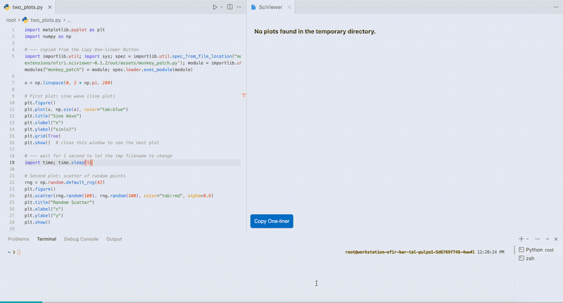

# 🔬 SciViewer — Seamless Python Plot Visualization in VS Code

**Capture matplotlib plots automatically and view them inside VS Code — no X11 forwarding, no `savefig` boilerplate, no broken GUI backends over SSH.**

SciViewer intercepts your `plt.show()` calls, saves each figure, and displays it in a live panel right inside the editor. It's built for researchers and data scientists working in remote Python environments where opening a plot window is painful or impossible.

<!-- DEMO GIF: drop a recording here once available, e.g. media/demo.gif -->
<!--  -->
> 📽️ _Demo GIF coming soon — see [How It Works](#-how-it-works) below._

## ✨ Features

- **Zero-setup auto-injection** — open a Python file, run it, and plots are captured automatically. No code changes.
- **Live plot panel** — figures appear in a VS Code panel as soon as `plt.show()` runs.
- **Thumbnail gallery** — browse recent plots; zoom and pan for detailed inspection.
- **Rich metadata** — each plot records its source script, function, line number, figure size, DPI, and axes info.
- **Jupyter-aware** — detects and patches notebook kernels alongside scripts.
- **Automatic cleanup** — keeps the most recent 100 plots, removes older ones.
- **Status bar integration** — shows whether injection is active and how many sessions are patched.
- **Cross-platform** — Windows, macOS, Linux.

## 🚀 Quick Start

1. Install **SciViewer** from the VS Code Marketplace (or search "SciViewer" in the Extensions view).
2. Open any Python file that uses matplotlib.
3. Run it. Your plots appear in the SciViewer panel automatically.

```python
import matplotlib.pyplot as plt
import numpy as np

x = np.linspace(0, 10, 100)
plt.plot(x, np.sin(x))
plt.title("Auto-captured by SciViewer")
plt.show()   # → appears in the SciViewer panel
```

No `%matplotlib` magic, no backend configuration, no manual `savefig`.

## 🔧 How It Works

SciViewer injects a small Python patch (`monkey_patch.py`) into your active Python session. The patch replaces `matplotlib.pyplot.show()` and `Figure.show()` so that, instead of opening a GUI window, each figure is:

1. Saved as a high-quality PNG (150 DPI) to a temp folder (`$TMPDIR/sciviewer`).
2. Recorded with metadata (source location, figure properties, timestamp).

The extension watches that folder and renders new plots in its panel. Because the capture happens at the matplotlib level, it works the same locally, over SSH Remote, in containers, and in Codespaces — anywhere your Python runs.

> **Note:** the patch overrides `plt.show()` for the patched session, so plots are routed to SciViewer rather than a native window. Originals are stored so behavior can be restored.

## ⚙️ Configuration

Open settings (`Ctrl+,`) and search for "SciViewer":

| Setting | Default | Description |
|---------|---------|-------------|
| `sciviewer.autoInject` | `true` | Auto-inject the patch when Python files are opened/run |
| `sciviewer.autoOpenPanel` | `true` | Open the panel automatically on the first plot |
| `sciviewer.detectJupyter` | `true` | Detect and patch Jupyter kernels |
| `sciviewer.showStatusBar` | `true` | Show injection status in the status bar |
| `sciviewer.injectionMethod` | `smart` | `automatic` (always), `manual` (never), or `smart` (context-aware) |

## 🎮 Commands

Run via the Command Palette (`Ctrl+Shift+P`):

| Command | Description |
|---------|-------------|
| `Open SciViewer` | Open the plot panel |
| `SciViewer: Toggle Auto-Injection` | Enable/disable auto-injection |
| `SciViewer: Inject Into Current Python Session` | Manually inject the patch |
| `SciViewer: Show Injection Status` | View current injection status |

## 📋 Requirements

- VS Code `1.93.0` or newer
- Python with `matplotlib` installed (`pip install matplotlib`)

## 🐛 Troubleshooting

**Plots not appearing?**
1. Check the status bar for injection status.
2. Confirm matplotlib is installed: `pip install matplotlib`.
3. Trigger manual injection: `Ctrl+Shift+P` → *SciViewer: Inject Into Current Python Session*.
4. Review settings: `Ctrl+,` → search "sciviewer".

**Using remote development?** SciViewer works with VS Code Remote SSH, GitHub Codespaces, Docker containers, and WSL — the capture runs wherever Python runs.

## 🗺️ Roadmap

- Multi-library support (Seaborn, Plotly, Bokeh)
- Group plots by experiment/run
- Export helpers (figure numbering, LaTeX)
- Restore-to-native-window toggle

## 🤝 Contributing

Contributions welcome.

```bash
git clone https://github.com/ofirbartal100/sciviewer
cd sciviewer
npm install
npm run compile
# Press F5 in VS Code to launch a development instance
```

1. Fork the repo
2. Create a feature branch
3. Make your changes
4. Open a pull request

## 📄 License

MIT — see [LICENSE](LICENSE).

---

*Built for researchers and data scientists who live in remote Python environments.*
